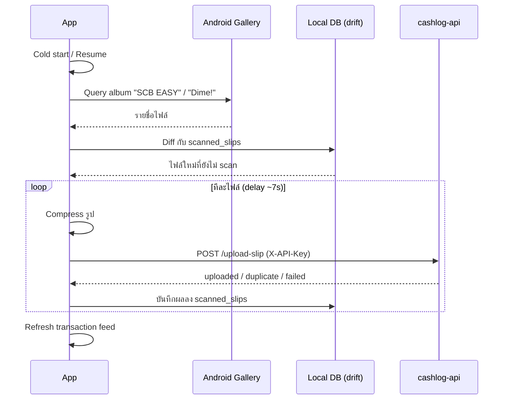

# Cashlog — Mobile Client

[](https://github.com/<username>/cashlog-app/actions/workflows/ci.yml)


Flutter client สำหรับระบบจัดการรายรับ-รายจ่ายส่วนตัว ที่สแกนสลิปโอนเงินจาก gallery แบบอัตโนมัติ แล้วสร้างรายการธุรกรรมผ่าน AI (Gemini) โดยไม่ต้องกรอกข้อมูลเอง

> Backend (Go/Fiber + Clean Architecture): [`cashlog-api`](https://github.com/<username>/cashlog-api) — ระบบนี้เป็น full-stack project ที่ทั้งสอง repo ทำงานร่วมกัน

---

## ✨ Features

- 📸 **Auto-scan สลิปจาก Gallery** — ตรวจ album ธนาคาร (SCB EASY, Dime!) อัตโนมัติทั้งตอนเปิดแอปและ resume ไม่ต้องอัปโหลดเอง
- 🤖 **AI OCR ผ่าน backend** — อ่านยอดเงิน/ชื่อผู้โอนจากรูปสลิปด้วย Gemini แล้วสร้างธุรกรรมให้ทันที
- 💰 **Dashboard รายเดือน** — สรุปรายรับ/รายจ่าย พร้อม month selector
- 🏦 **จัดการบัญชี/หมวดหมู่** — CRUD เต็มรูปแบบ พร้อม quick category assignment แบบ tap-chip ในหน้า feed
- 📴 **Offline-friendly read** — อ่านข้อมูลจาก local cache ได้แม้ไม่มีเน็ต, คิว retry สำหรับ action ที่ fail ตอนออฟไลน์

## 🏗️ Architecture

Feature-first + Clean Architecture (data / domain / presentation ต่อ feature) — ออกแบบคู่กับ [`cashlog-api`](https://github.com/<username>/cashlog-api) แต่ไม่ยึด layer ให้ตรงกัน 1:1 เพราะข้อจำกัดของ mobile ต่างจาก backend

```
lib/
├── core/          # network (dio), db (drift), env, router
├── features/      # slip_scan, transactions, dashboard, accounts, categories
└── shared/        # widgets ที่ใช้ข้าม feature
```

| Layer | เลือกใช้ | เหตุผล |
|---|---|---|
| State management | Riverpod (+ codegen) | ลด boilerplate, sync กับ pattern ใน [ANS Part](https://github.com/<username>/ans-part) |
| Networking | dio + dartz `Either<Failure, T>` | ไม่ throw exception ข้าม layer, error handling consistent |
| Local persistence | drift (typed SQLite) | cache-first read, offline queue |
| Routing | go_router | declarative, deep-link friendly |

### Auto-scan sequence



## 🔧 Tech Stack

Flutter · Riverpod · dio · drift · go_router · photo_manager · flutter_image_compress

## 🚀 Getting Started

```bash
flutter pub get
dart run build_runner build --delete-conflicting-outputs

# รันด้วย env ที่ต้องการ (ดู env/dev.json.example)
flutter run --dart-define-from-file=env/dev.json
```

ต้องมีไฟล์ `env/dev.json` (ไม่ commit เข้า git):
```json
{
  "BASE_URL": "https://your-dev-api.example.com",
  "API_KEY": "your-dev-api-key"
}
```

## 🧪 Testing & CI

```bash
flutter analyze
flutter test
```

CI (GitHub Actions) รัน analyze + test + build ทุก push/PR — ดู [`.github/workflows/ci.yml`](.github/workflows/ci.yml)

## 📝 Design Decisions

รายละเอียดการตัดสินใจด้าน architecture (state management, offline strategy, rate-limit handling ฯลฯ) อยู่ใน [`docs/`](docs/) — สรุปจาก structured design sessions ก่อนเริ่ม implement

## 🔗 Related

- [`cashlog-api`](https://github.com/<username>/cashlog-api) — Go/Fiber backend, Clean Architecture, deploy บน Cloud Run
